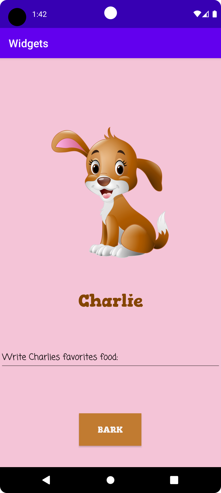

# Rapport

**Skriv din rapport här!**

Först forkades ett projekt från GitHub. Därefter för att öppna upp projektet i Android Studio, 
valdes `File` > `New` > `Project from version control`. Där finns sitt egna github-konto
och där hämtades projektet.

## Add a layout of your choice, e.g. `LinearLayout` or `ConstraintLayout`

Valde designläget för en mer bekvämlighet. I `Design` läget är det enkelt att lägga till 
val av layout till `Designer - Component Tree` genom att bara dra önskade View. I detta fall 
valdes en `constraint layout`. 

## Add a `ImageView` widgets inside the layout

I designläget under `Palett` och `Common` valdes en `ImageView` genom att dra den till fönstret 
`Designer - Component Tree`. Här kommer då ett fönster upp kallat `Pick a Resourse`. I detta fönster
finns möjlighet att välja befintlig data av bilder eller så går det välja egenvald bild. Här valdes 
egenvald bild från datorn genom att välja `+` uppe i vänstra hörnet. Sedan valdes `Import Drawables`. 
Då kommer man till datorns egna bilder. Viktigt här är att välja en `png-fil`. 

Valde sedan `quality type` > `next`. Då hamnade bilden i katalogen `res` och mappen `drawable`. 
Valde där bilden för att importera. Den hamnar då i `Widget.app.main` och där markerar man bilden 
och trycker `OK`. I designläget ändrades sedan bilden till önskad storlek och plats genom att med 
markören "dra" i bilden till önskad storlek samt plats.

## Add a `TextView` widgets inside the layout

I designläget under `Palett` och `Common` valdes en `TextView` genom att dra den till fönstret 
`Designer - Component Tree`. I `activity_main.xml` filen skapas då en kod för detta objekt. 
Se nedan kod (Kod.1). 

Denna kod ändrades en del i för att lägga till hundens namn, "Charlie" samt ändrades koden så att 
texten fick storleken 32sp samt centrerades texten. Detta gjordes genom att skriva in ny kod i 
`activity_main.xml` filen. Därefter ändrades även fonten på namnet "Charlie". Detta gjordes däremot 
i `Design` läget i `Declared Attributes` > `fontFamily` > `gorditas_bold`. Båda sättet är möjliga 
och här testades båda sätten. Koden för detta syns i nedan kod (Kod.2) Även här i `Design`
läget ändrades bakgrundsfärgen under `All Attributes` > `background`. 

Kod som lades till: 

```
    <TextView
        android:id="@+id/textView5"
        android:layout_width="wrap_content"
        android:layout_height="wrap_content"
        android:text="TextView"
        app:layout_constraintEnd_toEndOf="parent"
        app:layout_constraintStart_toStartOf="parent"
        tools:layout_editor_absoluteY="718dp" />
```
Kod som ändrades: 

```
  <TextView
        android:id="@+id/textView5"
        android:layout_width="183dp"
        android:layout_height="43dp"
        android:layout_marginTop="16dp"
        android:fontFamily="@font/gorditas_bold"
        android:text="Charlie"
        android:textAlignment="center"
        android:textColor="#844502"
        android:textSize="32sp"
        app:layout_constraintEnd_toEndOf="parent"
        app:layout_constraintStart_toStartOf="parent"
        app:layout_constraintTop_toBottomOf="@+id/imageView9" />
```

## Add a `Button` widgets inside the layout
I designläget under `Palett` och `Common` valdes en `Button` genom att dra den till fönstret
`Designer - Component Tree`. Då kom en vit "knapp" med texten text upp på devicen. Denna knappens
layout ändrades sedan genom tillvalen som finns under `Attributes`. Texten ändrades till `BARK`samt 
fonten, textstorleken och färgen, även knappens färg ändrades. 

En ljudeffekt av en skällande hund lades till knappen. Detta skapades genom att skapa en ny mapp 
genom att högerklicka på `res` > `New` > `Android Resource Directory`. Döpte mappen till `raw` där 
sedan en mp3 fil av hundskall lades till. Sedan var det bara att lägga till kod i 
´MainActivity.java` filen för att få detta att fungera. 

## Add a `EditText` widgets inside the layout
I designläget under `Palett` och `Text` valdes en `Plain Text` genom att dra den till fönstret
`Designer - Component Tree`.
I designläget ändrades sedan texten "Namn" och en annan font valdes samt typsnittet bold. 
Placeringen till alla widgets är bestämda.

```
 <EditText
        android:id="@+id/editTextTextPersonName"
        android:layout_width="wrap_content"
        android:layout_height="wrap_content"
        android:layout_marginTop="60dp"
        android:ems="18"
        android:fontFamily="casual"
        android:inputType="textPersonName"
        android:selectAllOnFocus="false"
        android:singleLine="false"
        android:text="Write Charlies favorites food:"
        android:textSize="16sp"
        android:textStyle="bold"
        app:layout_constraintBottom_toTopOf="@+id/Button"
        app:layout_constraintEnd_toEndOf="parent"
        app:layout_constraintStart_toStartOf="parent"
        app:layout_constraintTop_toBottomOf="@+id/textView5"
        app:layout_constraintVertical_bias="0.0" />
 ```


**Figur 1.**